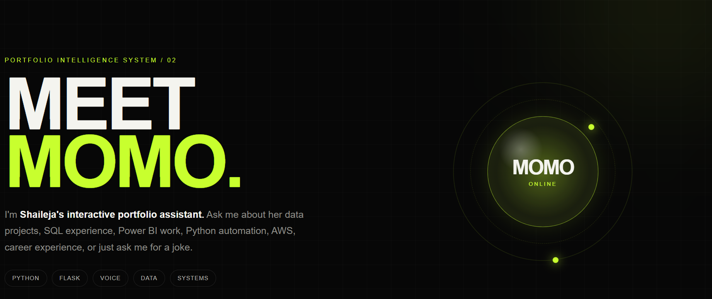

# 🤖 Momo 2.0 — Voice-Enabled Portfolio Assistant

Momo is an interactive voice-enabled portfolio assistant designed to help visitors explore **Shaileja Kuthuru's professional experience, technical skills, projects, education, and certifications** through natural text and voice interaction.

Momo started as a lightweight Python/Flask assistant and later evolved into an interactive assistant integrated directly into my Next.js portfolio.

🌐 **Live Portfolio:** https://www.shailejak.com

---
## 🖥️ Momo 2.0 Demo



Momo provides an interactive way to explore my professional experience, technical skills, projects, education, and certifications through text and voice interaction.
## ✨ Features

- 💬 Interactive text-based chat
- 🎙️ Voice input using browser speech recognition
- 🔊 Spoken responses using browser speech synthesis
- 🧠 Intent-based query processing
- 👩‍💻 Portfolio-specific knowledge
- 📊 Project and technical skill exploration
- 💼 Professional experience queries
- 🎓 Education and certification information
- 📄 Resume access
- 🔗 GitHub and LinkedIn navigation
- 📱 Responsive interface
- 🚀 Production deployment with Vercel

---

## 💬 Example Questions

Visitors can ask Momo questions such as:

- Who is Shaileja?
- What are Shaileja's skills?
- Tell me about her experience.
- What projects has she built?
- Tell me about the Amazon Sales Dashboard.
- Tell me about DocuMind AI.
- What is her education?
- What certifications does she have?
- What technologies does she use?
- Open her resume.
- Open her LinkedIn.
- Open her GitHub.

---

## 🏗️ Architecture

```text
                    USER
                      │
               Text / Voice Input
                      │
                      ▼
          React + TypeScript Interface
                      │
                 POST Request
                      │
                      ▼
              Next.js API Route
                  /api/momo
                      │
                      ▼
             Intent Processing
                      │
                      ▼
          Portfolio Knowledge Logic
                      │
                      ▼
                JSON Response
                      │
             ┌────────┴────────┐
             ▼                 ▼
       Chat Response      Browser Action
             │
             ▼
      Speech Synthesis
```

---

## 🛠️ Tech Stack

### Momo 2.0 — Current Portfolio Version

- Next.js
- React
- TypeScript
- REST-style API communication
- Web Speech API
- Speech Recognition
- Speech Synthesis
- Motion
- Git
- GitHub
- Vercel

### Momo 1.0 — Original Prototype

- Python
- Flask
- HTML
- CSS
- JavaScript

---

## ⚙️ How Momo Works

1. A visitor types or speaks a question.

2. When voice input is used, browser speech recognition converts the user's speech into text.

3. The React frontend sends the question to the Momo API endpoint.

4. The API processes the query and identifies the visitor's intent.

5. Portfolio-specific logic determines the appropriate response.

6. The API returns the response to the frontend as JSON.

7. The response appears inside the Momo chat interface.

8. When voice output is enabled, browser speech synthesis reads the response aloud.

9. Certain intents can also trigger browser actions such as opening the resume, GitHub, or LinkedIn.

---

## 🧠 Intent-Based Processing

Momo currently uses controlled intent-based processing for portfolio-specific questions.

Example:

```text
User:
"What are Shaileja's skills?"

        ↓

Momo identifies:
SKILLS INTENT

        ↓

Portfolio knowledge is retrieved

        ↓

Momo:
"Shaileja works with Python, SQL, Power BI,
AWS, automation, data analysis..."
```

This approach keeps Momo's responses focused on verified portfolio information.

---

## 🎙️ Voice Interaction

Momo supports browser-based voice interaction.

### Speech Recognition

Voice input is converted into text using browser speech recognition capabilities.

```text
User speaks
     ↓
Speech Recognition
     ↓
Text Query
     ↓
Momo API
```

### Speech Synthesis

Momo can also convert its response back into speech.

```text
Momo Response
     ↓
Speech Synthesis
     ↓
Spoken Response
```

This creates a more interactive portfolio experience than a traditional static website.

---

## 🚀 Evolution of Momo

### Momo 1.0

The original version of Momo was built as a lightweight Flask-based assistant.

Features included:

- Python backend
- Flask web server
- Basic intent matching
- Simple browser interface
- Small-talk responses
- Portfolio-related commands
- Website-opening actions

### Momo 2.0

Momo was later redesigned and integrated directly into my production portfolio.

The updated version introduced:

- React-based chat interface
- TypeScript
- Next.js API integration
- Portfolio-specific knowledge
- Browser speech recognition
- Browser speech synthesis
- Resume navigation
- GitHub navigation
- LinkedIn navigation
- Responsive UI
- Production deployment

---

## 📁 Current Portfolio Integration

The production version of Momo is integrated into my main Next.js portfolio.

```text
shaileja-portfolio/
│
├── app/
│   │
│   ├── api/
│   │   └── momo/
│   │       └── route.ts
│   │
│   ├── components/
│   │   └── MomoChat.tsx
│   │
│   └── page.tsx
│
├── public/
│
└── package.json
```

---

## 📁 Original Flask Prototype

The original standalone prototype follows a simple Flask structure:

```text
momo-voice-assistant/
│
├── app.py
│
├── templates/
│   └── index.html
│
├── README.md
│
└── .gitignore
```

---

## ▶️ Running the Original Flask Prototype

Clone the repository:

```bash
git clone https://github.com/shailejasagar/momo-voice-assistant.git
```

Move into the project:

```bash
cd momo-voice-assistant
```

Install Flask:

```bash
pip install flask
```

Run the application:

```bash
python app.py
```

Then open:

```text
http://127.0.0.1:5000
```

---

## 💡 What I Learned

Building and evolving Momo gave me hands-on experience with:

- Python application development
- Flask
- React component development
- TypeScript
- Next.js
- REST API communication
- Intent-based assistant design
- Browser speech recognition
- Speech synthesis
- Frontend/backend integration
- Git version control
- GitHub workflows
- Production deployment
- Debugging development vs. production issues

---

## 🔮 Future Improvements

Momo currently uses intent-based processing. Future versions can expand the assistant with:

- Large Language Model integration
- Retrieval-Augmented Generation (RAG)
- Vector embeddings
- Vector database integration
- Context-aware conversations
- Conversation memory
- Streaming responses
- Expanded portfolio knowledge
- Improved natural-language understanding
- More advanced voice interaction

The goal is to evolve Momo from an intent-based portfolio assistant into a more context-aware AI portfolio agent.

---

## 👩‍💻 Author

**Shaileja Kuthuru**

🌐 Portfolio: https://www.shailejak.com

💻 GitHub: https://github.com/shailejasagar

🔗 LinkedIn: https://www.linkedin.com/in/shailejakuthuru123

---

## ⭐ About This Project

Momo demonstrates how a traditional portfolio can be transformed into an interactive experience by combining **software development, APIs, voice interfaces, automation, and conversational interaction**.

Instead of requiring visitors to manually search through a portfolio, Momo allows them to explore professional information conversationally.